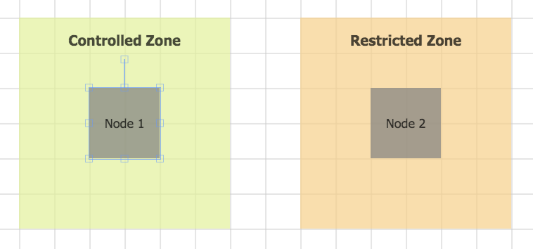
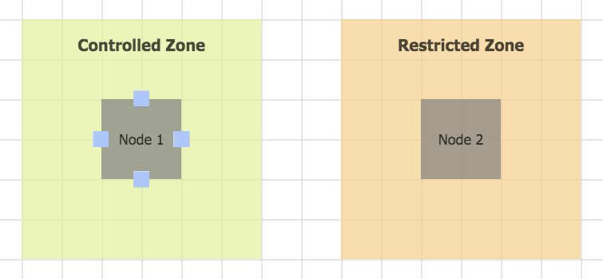
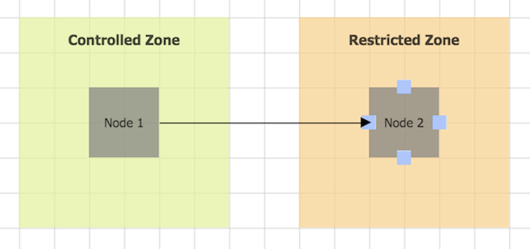
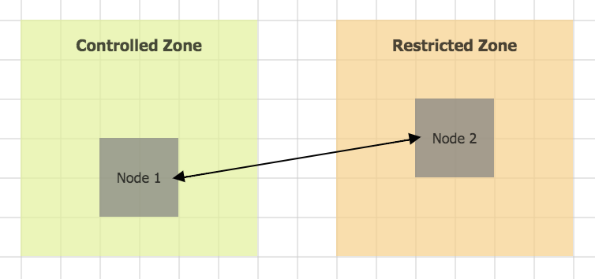
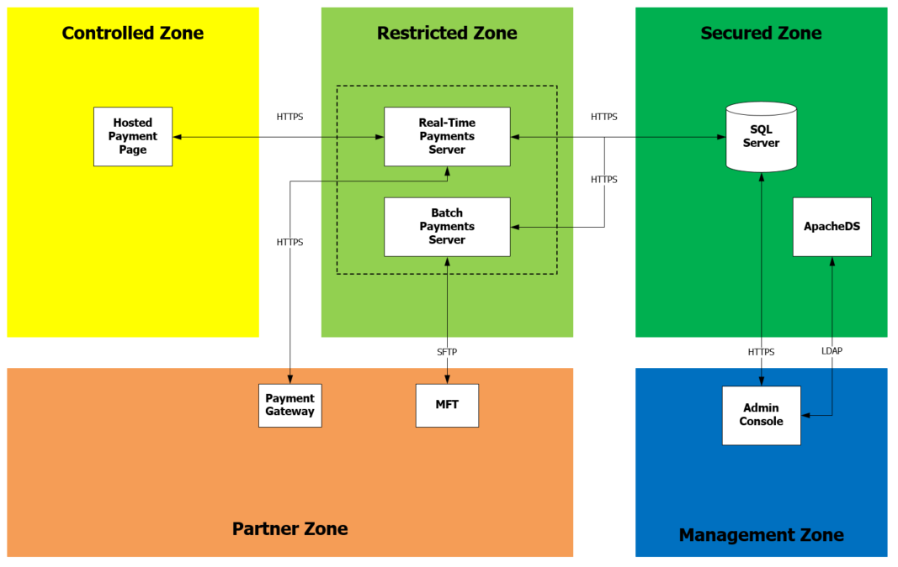

# AngularJS & FabricJS - 2D - Diagram

A browser-based 2D diagram editor, built using AngularJS, AngularUI and Fabric.js.

Formatting shapes and containers:

 
Interactivity:

How to highlight ports:

 

How to draw connections:

How to update connections:

A sample Logical Security Zone Model diagram:

