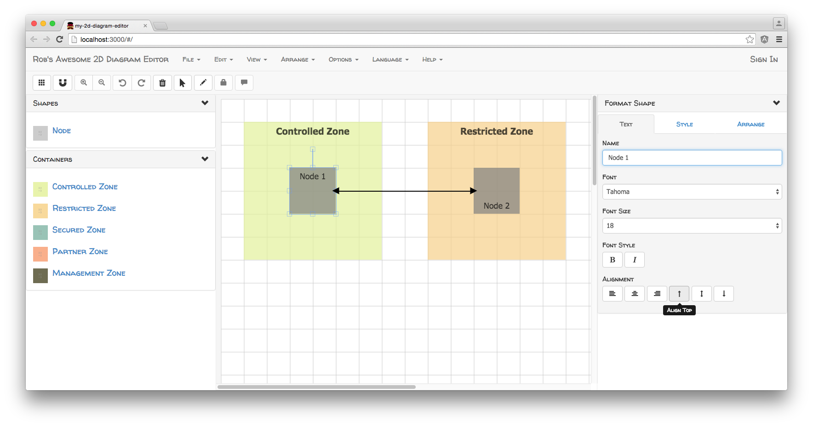

# AngularJS & FabricJS - 2D - Diagram

## About

A browser-based 2D diagram editor, built using AngularJS, AngularUI and Fabric.js.
This project is built by [Big-Silver].

## Pre-Install

If you didn't install bower and gulp, For install for bower visit to https://www.npmjs.com/package/bower and for install for gulp 
visit to https://semaphoreci.com/community/tutorials/getting-started-with-gulp-js

## Install and Run

`git clone https://github.com/Big-Silver/Angular-FabricJS-2d-Diagram.git 2d-diagram`
`cd 2d-diagram/client`
`npm install`
`gulp`
visit `http://localhost:8001`

